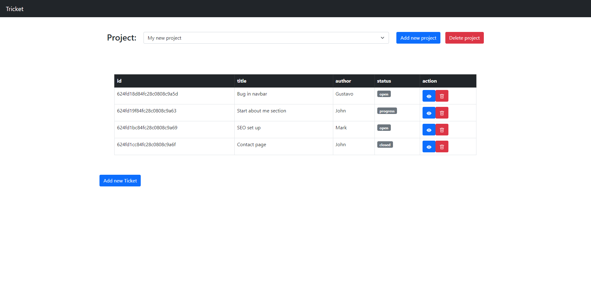

# tricket

Tricket is a web application that allows you to add, edit and track tickets/tasks for your various projects.
<br><br>


## About The Project



Tricket makes you more productive by giving you a view of your tasks and tickets that needs to be worked on.
<br><br>

## Live version

You can find the live version: [here](https://tricket.herokuapp.com/)
<br><br>

## Built With

* [React.js](https://reactjs.org/)
* [Bootstrap](https://getbootstrap.com)
<br><br>

## Running the project locally

1. Clone the repo
   ```sh
   git clone https://github.com/gustavocsak/tricket
   ```
2. Install NPM packages
   ```sh
   npm install
   ```
3. Credentials are needed for database access
<br><br>

## Current Features
- Add a new project
- Delete a project
- Add a new ticket
- Delete a ticket
- Edit an existing ticket
<br><br><br><br>

## API documentation

All api endpoints are found through https://tricket.herokuapp.com/api/v1

## API endpoints

### GET /projects

Used for getting a list of projects
Example request:<br>
```sh
GET https://tricket.herokuapp.com/api/v1/projects
```

Example response:<br>
```javascript
[
    {
        "_id": "624fd0f984fc28c0808c9a57",
        "name": "My new project",
        "author": "myself",
        "tickets": [
            "624fd18d84fc28c0808c9a5d",
            "624fd19f84fc28c0808c9a63",
            "624fd1bc84fc28c0808c9a69",
            "624fd1cc84fc28c0808c9a6f"
        ],
        "__v": 4
    },
    {
        "_id": "624fd6b071cb6fdd7345be4c",
        "name": "Website",
        "author": "myself",
        "tickets": [],
        "__v": 0
    }
]
```
<br><br>

### GET /projects/:id

Used for getting project by id

Example request:<br>
```sh
GET https://tricket.herokuapp.com/api/v1/projects/624fd0f984fc28c0808c9a57
```

Example response:<br>
```javascript

{
    "_id": "624fd0f984fc28c0808c9a57",
    "name": "My new project",
    "author": "myself",
    "tickets": [
        "624fd18d84fc28c0808c9a5d",
        "624fd19f84fc28c0808c9a63",
        "624fd1bc84fc28c0808c9a69",
        "624fd1cc84fc28c0808c9a6f"
    ],
    "__v": 4
}

```
<br><br>

### POST /projects

Used to post a new project

Example request:<br>
```sh
POST https://tricket.herokuapp.com/api/v1/projects
```
Example body:<br>
```javascript
{
    "name": "My new project",
    "author": "myself",
    "description": "lets start this again"
}
```
Example response:<br>
```javascript
{
    "url": "/api/v1/projects/624fd7c971cb6fdd7345be50",
    "data": {
        "name": "My new project",
        "author": "myself",
        "tickets": [],
        "_id": "624fd7c971cb6fdd7345be50",
        "__v": 0
    }
}
```
<br><br>


### GET /projects/:id/tickets

Used to get tickets in a project with specific id

Example request:<br>
```sh
GET https://tricket.herokuapp.com/api/v1/projects/624fd0f984fc28c0808c9a57/tickets
```

Example response:<br>
```javascript
{
    "_id": "624fd0f984fc28c0808c9a57",
    "name": "My new project",
    "author": "myself",
    "tickets": [
        {
            "_id": "624fd18d84fc28c0808c9a5d",
            "author": "Gustavo",
            "title": "Bug in navbar",
            "status": "open",
            "__v": 0
        },
        {
            "_id": "624fd19f84fc28c0808c9a63",
            "author": "John",
            "title": "Start about me section",
            "status": "progress",
            "__v": 0
        },
        {
            "_id": "624fd1bc84fc28c0808c9a69",
            "author": "Mark",
            "title": "SEO set up",
            "description": "Please start seo tasks",
            "status": "open",
            "__v": 0
        },
        {
            "_id": "624fd1cc84fc28c0808c9a6f",
            "author": "John",
            "title": "Contact page",
            "description": "Contact page done",
            "status": "closed",
            "__v": 0
        }
    ],
    "__v": 4
}
```

### POST /projects/:id/tickets

Example request:<br>
```sh
POST https://tricket.herokuapp.com/api/v1/projects/624fd6b071cb6fdd7345be4c/tickets
```
Example body:<br>
```javascript
{
    "title": "something wrong with section 3",
    "author": "gustavo",
    "description": "please fix section 3 needs padding and margin",
    "status": "open"
}
```
Example response:<br>
```javascript
{
    "url": "/api/v1/tickets/624fd6b071cb6fdd7345be4c",
    "data": {
        "_id": "624fd6b071cb6fdd7345be4c",
        "name": "Website",
        "author": "myself",
        "tickets": [
            "624fd9b271cb6fdd7345be5d"
        ],
        "__v": 1
    }
}
```
<br><br>


### PATCH /tickets/:id

Used to update a ticket by id

Example request:<br>
```sh
PATCH https://tricket.herokuapp.com/api/v1/tickets/624fd9b271cb6fdd7345be5d
```
Example body:<br>
```javascript
{
    "title": "something wrong with section 63",
    "author": "gustavo and carl",
    "description": "please fix section 63 fix only margin (not padding)",
    "status": "open"
}
```
Example response:<br>
```javascript
{
    "url": "/api/v1/tickets/624fd6b071cb6fdd7345be4c",
    "data": {
          "_id": "/api/v1/tickets/624fd6b071cb6fdd7345be4c",
          "title": "something wrong with section 63",
          "author": "gustavo and carl",
          "description": "please fix section 63 fix only margin (not padding)",
          "status": "open"
    }
}
```
<br><br>


### DELETE /tickets/:id

Used to delete a ticket by id

Example request:<br>
```sh
DELETE https://tricket.herokuapp.com/api/v1/tickets/624fd1cc84fc28c0808c9a6f
```

Example response:<br>
```javascript
{
    "message": "item deleted"
}
```
<br><br>

### DELETE /projects/:id

Used to delete a project by id

Example request:<br>
```sh
DELETE https://tricket.herokuapp.com/api/v1/projects/624fd0f984fc28c0808c9a57
```

Example response:<br>
```javascript
{
    "message": "item deleted"
}
```
<br><br>


